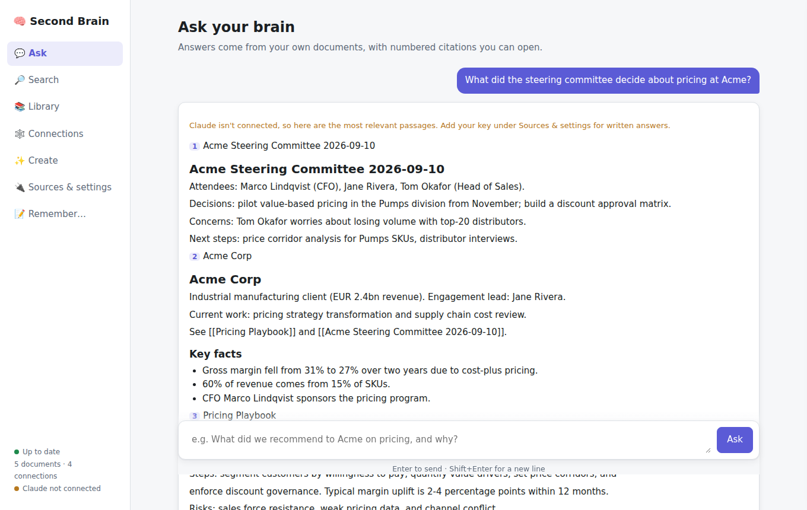
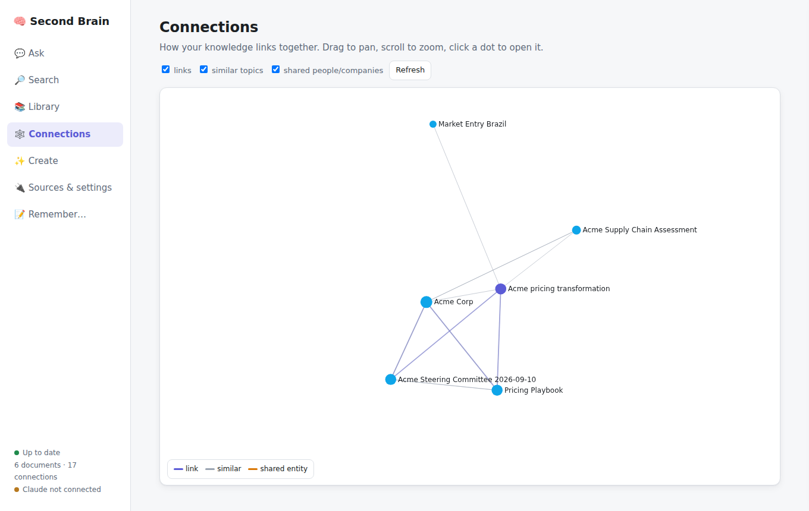
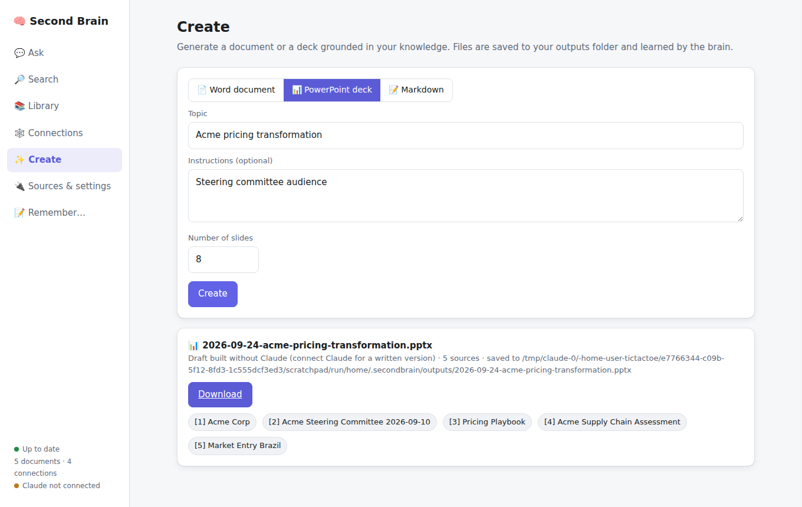

# 🧠 Second Brain

A personal knowledge system that **connects** your folders, drives and apps, **links** everything it
reads into a knowledge graph, **keeps learning** as things change, and **creates** answers, documents
and slide decks from what you know, using Claude.

```
  Local folders ─┐                                   ┌─► brain ask       (cited answers)
  OneDrive / SP ─┤                                   ├─► brain create docx (briefs, memos, proposals)
  Dropbox/iCloud ┼─► sync ─► parse ─► index ─► link ─┼─► brain create deck (PowerPoint)
  Google Drive  ─┤   (incremental)      │       │    ├─► MCP server  ─► Claude Desktop / Code / Cowork
  Web pages/PDF ─┤                      │       │    └─► REST API    ─► Zapier, n8n, scripts, bots
  Any JSON API  ─┘              full-text   graph: explicit links,
  remember(…)  ──────────────►  + revisions  similar topics, shared entities
```

## What it does

| Capability | How |
|---|---|
| **Stores everything** | One SQLite file (`brain.db`) holds text, chunks, full-text index, links and revision history. It works offline, is portable, and you back it up by copying one file. |
| **Reads many formats** | Markdown/text, PDF, Word, PowerPoint, Excel (optional), HTML, CSV/JSON, email (`.eml`), code. |
| **Connects online + offline places** | Local and external drives; any cloud with a desktop sync client (OneDrive, SharePoint, Dropbox, Google Drive, iCloud, Box); Google Drive via API; web pages and online PDFs; **any JSON REST API** set up in config, no code needed. |
| **Connects the knowledge** | Three edge types: **explicit** (`[[wikilinks]]`, markdown links), **related** (TF-IDF topic similarity), **entity** (the same people, companies or projects, found by Claude). |
| **Keeps learning** | `brain watch` syncs continuously. Changed files are re-indexed and the old version is kept as a revision. Deleted files are forgotten. An unplugged drive never wipes knowledge. `remember` captures facts from chat. Generated artifacts are indexed too, so the brain builds on its own work. |
| **Creates** | Cited answers, Markdown/Word documents, and PowerPoint decks (optionally on your branded template). Decks use action titles and speaker notes with citations. |
| **Plugs into other tools** | **MCP server**: Claude can use the brain alongside Gmail, Calendar, Slack and other MCP servers. **REST API** with bearer-token auth for everything else. |
| **Degrades gracefully** | Without Claude credentials, search, linking and sync still work. `ask` returns cited passages, and `create deck` builds an extractive draft. |

## Quick start: the app

**New here? Follow [GETTING_STARTED.md](GETTING_STARTED.md)** for a step-by-step guide for Windows and Mac.

Double-click **`Start Second Brain.bat`** (Windows) or **`Start Second Brain.command`** (Mac). The first run
installs everything, then opens the app at <http://localhost:8787>. From there you can add your folders,
paste your Claude key, and Ask / Search / browse Connections / Create documents and decks. While the app
is open it keeps syncing in the background.

| Ask with citations | Map of connections | Create decks & docs |
|---|---|---|
|  |  |  |

## Quick start: command line

```bash
cd second-brain
pip install -e ".[excel]"            # add ,gdrive for the Google Drive API connector
brain init                            # writes ~/.secondbrain/brain.toml from brain.example.toml
brain add folder notes ~/Documents/Notes
brain add folder clients "~/OneDrive - Contoso/Clients"
brain sync                            # first full index; later syncs only touch changes

export ANTHROPIC_API_KEY=sk-ant-...   # or: ant auth login
brain ask "What did we recommend to Acme on pricing, and why?"
brain create docx "Acme pricing strategy – executive brief"
brain create deck "Acme pricing strategy" --slides 8 --instructions "board audience"
brain enrich --limit 50               # Claude summarises, tags, extracts entities -> more connections
brain watch                           # keep learning in the background
```

Other commands: `ui`, `search`, `show <id>`, `related <id>`, `remember "…"`, `status`, `graph --out g.json`, `api`, `mcp`.

## Use it from Claude (MCP)

Add this to Claude Desktop's `claude_desktop_config.json` (or `claude mcp add` in Claude Code):

```json
{
  "mcpServers": {
    "second-brain": {
      "command": "brain",
      "args": ["mcp"],
      "env": { "ANTHROPIC_API_KEY": "sk-ant-..." }
    }
  }
}
```

Tools exposed: `search`, `get_document`, `related`, `ask`, `remember`, `create_document`, `create_deck`,
`sync`, `status`. Claude can then do things like *"Check my inbox for anything from Acme, cross-reference
it with what the brain knows, and draft a status deck."* That combines this server with your Gmail and
Drive connectors. For remote clients use `brain mcp --http --port 8765`.

## Use it from other tools (REST)

```bash
BRAIN_API_TOKEN=change-me brain api --port 8787
curl -H "Authorization: Bearer change-me" "localhost:8787/search?q=pricing"
curl -H "Authorization: Bearer change-me" -d '{"question":"Top risks for Acme?"}' localhost:8787/ask
curl -H "Authorization: Bearer change-me" -d '{"text":"Acme signed the SOW","title":"Acme SOW"}' localhost:8787/remember
```

Full endpoint list is in [`secondbrain/api.py`](secondbrain/api.py). The API binds to `127.0.0.1` by default.

## Adding a new connector

Write a class with `items()` that yields `Item(uri, title, ext, modified, load)` and register it in
[`connectors/__init__.py`](secondbrain/connectors/__init__.py). The indexer handles change detection,
parsing, revisions, deletion and linking.

## Tests

```bash
pip install -e ".[dev]" && pytest -q
```

The suite syncs real Markdown, Word and PowerPoint files. It covers incremental sync, revisions, deletions,
offline sources, the graph, `remember`, cited answers, docx and pptx generation, learning from outputs,
entity linking, the REST API with auth, and the MCP tool surface.

See [ARCHITECTURE.md](ARCHITECTURE.md) for design decisions, the build-vs-buy view and the roadmap.
